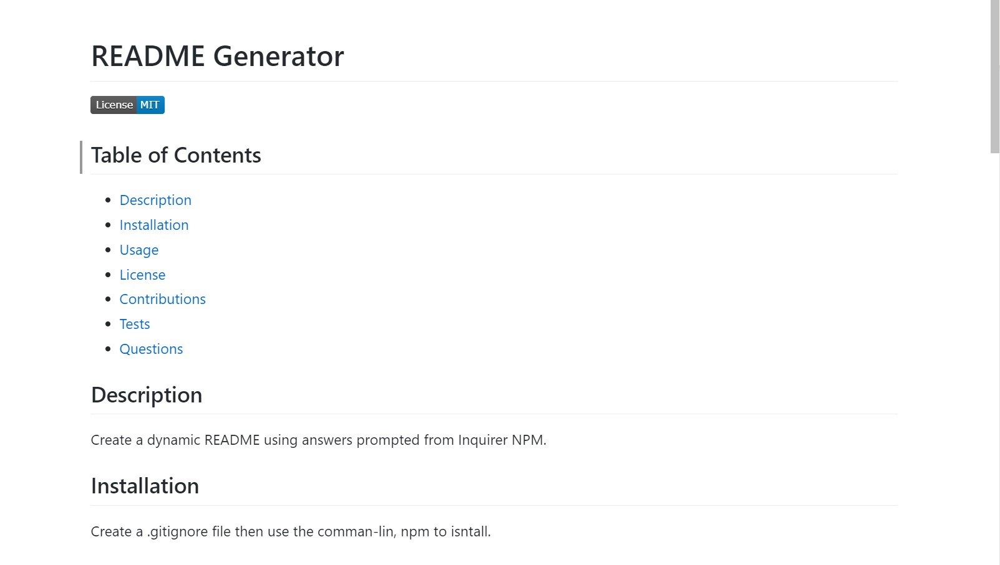
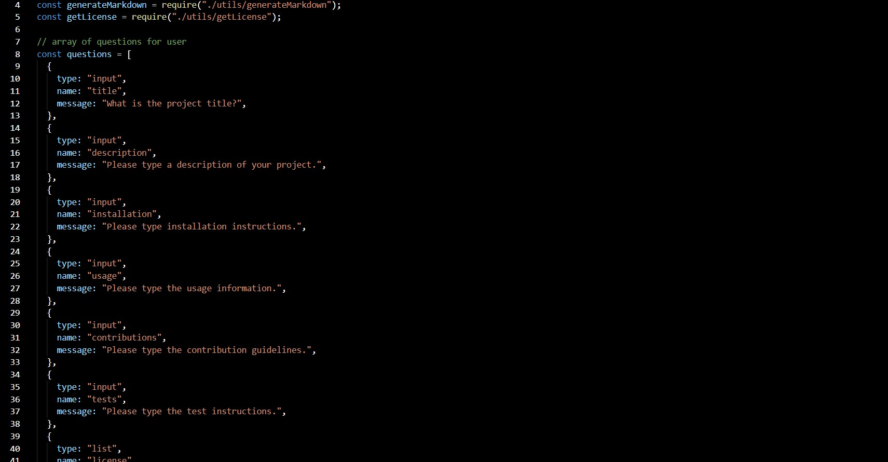

# README Generated Using Inquirer NPM

## Overview

As a developer, I want to be able to dynamically and quickly create a quality README using answers provided from
Inquirer NPM.

## Table of Contents

- [Description](#description)
- [Installation](#installation)
- [Usage](#usage)
- [Deployed](#deployed)
- [Tools](#tools)
- [Research](#research)
- [Questions](#questions)
- [License](#license)

## Description

To dynamically and quickly create a quality README, Inquirer NPM was utilized to:

- Generate command-line questions to the user.
- The user input was gathered and added as markdown to a pre-written README.MD in their appropriate README sections.

## Installation

1. Create a .gitignore file and include node_modules? and .DS store. This ensures that the node_modules directory isn't
   tracked or uploaded to GitHub.
2. Use the command-line, npm install, to install Inquirer NPM.
3. To start answering questions to write the README, use the command, node index.js.

## Usage

- Inquirer NPM is used to prompt the user to provide information regarding their GitHub projected to create their
  README.
- fs.writeFile is used to render the markdown to a pre-written README.MD.
- Once the user's information regarding which license is used:
  - A badge for the appropriate license will be added using the information from https://shields.io/.
  - The license text will be printed in the License section exported from the getLicense.js function and file.
- A clickable table of contents is created based on the user's provided info.
- The user's GitHub profile and email are added to the Questions section as a clickable links.

## Deployed

- \*[Demo Video](https://youtu.be/ObRt8Nd-Nxk)
- \*[Deployed website](https://kay0s.github.io/Create-ReadMe-With-Inquirer-NPM/)
- \*[GitHub Repository](https://github.com/Kay0s/Create-ReadMe-With-Inquirer-NPM)
- \*[Example README Using App](./createdReadMe.md)

### Screenshot of Example README

### Screenshot of Inquirer Questions Code

## Tools

- JavaScript
- Inquirer NPM
- .gitignore
- Git Bash

## Research

- [Inquirer.js - NPM](https://www.npmjs.com/package/inquirer)
- [Choose a License](https://choosealicense.com/)
- [Shields.io - License](https://shields.io/category/license)
- [Apache License](https://www.apache.org/licenses/LICENSE-2.0)
- [stackoverflow - Get the Current Year in JavaScript](https://www.apache.org/licenses/LICENSE-2.0)

## Questions

- [Email](hamilton.kristina@gmail.com)
- [GitHub Profile](https://github.com/Kay0s)
- [GitHub Repository](https://github.com/Kay0s/Create-ReadMe-With-Inquirer-NPM)

## License

© 2020 Kristina Hamilton and Trilogy Education Services, a 2U, Inc. brand. All Rights Reserved. Permission is hereby
granted, free of charge, to any person obtaining a copy of this software and associated documentation files (the
"Software"), to deal in the Software without restriction, including without limitation the rights to use, copy, modify,
merge, publish, distribute, sublicense, and/or sell copies of the Software, and to permit persons to whom the Software
is furnished to do so, subject to the following conditions:

The above copyright notice and this permission notice shall be included in all copies or substantial portions of the
Software.

THE SOFTWARE IS PROVIDED "AS IS", WITHOUT WARRANTY OF ANY KIND, EXPRESS OR IMPLIED, INCLUDING BUT NOT LIMITED TO THE
WARRANTIES OF MERCHANTABILITY, FITNESS FOR A PARTICULAR PURPOSE AND NONINFRINGEMENT. IN NO EVENT SHALL THE AUTHORS OR
COPYRIGHT HOLDERS BE LIABLE FOR ANY CLAIM, DAMAGES OR OTHER LIABILITY, WHETHER IN AN ACTION OF CONTRACT, TORT OR
OTHERWISE, ARISING FROM, OUT OF OR IN CONNECTION WITH THE SOFTWARE OR THE USE OR OTHER DEALINGS IN THE SOFTWARE.
